# Attendance Monitor — User Manual

Welcome! 👋 This guide walks you through the **CSI Interfusion Attendance Monitor** in plain English. Whether you're an employee clocking in for the day or an admin reviewing the team, you'll find everything you need here.

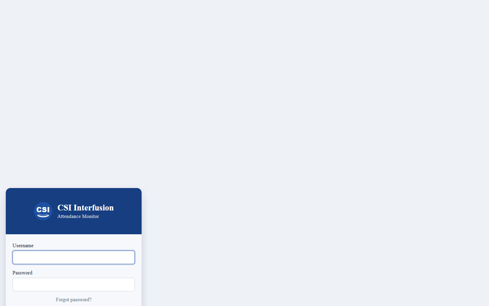

> All times displayed in the app automatically follow **your browser's local timezone**. Behind the scenes, schedule rules use **PHT (UTC+8)** for Philippines users and **IST (UTC+5:30)** for India users.

---

## Table of contents

1. [What this app does](#what-this-app-does)
2. [Who uses it (roles)](#who-uses-it-roles)
3. [Getting started](#getting-started)
   - [Register an account](#register-an-account)
   - [Sign in](#sign-in)
   - [Forgot your password?](#forgot-your-password)
   - [Change your password](#change-your-password)
4. [The layout at a glance](#the-layout-at-a-glance)
5. [For employees](#for-employees)
   - [Your dashboard](#your-dashboard)
   - [Checking in and out](#checking-in-and-out)
   - [Taking a break or lunch](#taking-a-break-or-lunch)
   - [Selfie capture](#selfie-capture)
   - [Viewing your attendance history](#viewing-your-attendance-history)
   - [Your schedule](#your-schedule)
   - [Filing a request](#filing-a-request)
   - [Your profile](#your-profile)
6. [For admins, PMs and Program Managers](#for-admins-pms-and-program-managers)
   - [Team dashboard](#team-dashboard)
   - [Approving new users](#approving-new-users)
   - [Managing users](#managing-users)
   - [Editing schedules](#editing-schedules)
   - [Reviewing requests](#reviewing-requests)
   - [Reports](#reports)
   - [Reminders (offline alerts)](#reminders-offline-alerts)
   - [Configuration (roles)](#configuration-roles)
   - [System settings](#system-settings)
7. [Tips, gotchas & FAQ](#tips-gotchas--faq)

---

## What this app does

The Attendance Monitor lets your team:

- **Clock in and out** with a one-click button (plus a quick selfie).
- See **who's online right now** thanks to a live heartbeat.
- Track **late arrivals**, **early checkouts**, **breaks** and **lunches** automatically.
- Submit **leave**, **shift change**, **add-time-entry** and **break/lunch reset** requests.
- Pull **daily** and **weekly** reports, with Excel/CSV export.
- Get an **email reminder** if a shift is started but the employee goes offline (or forgets to check out).

---

## Who uses it (roles)

| Role | What they can do |
|---|---|
| **Employee** | Check in/out, view their own attendance & schedule, file requests. |
| **Project Manager (PM)** | Same as admin, but scoped to their own **Business Unit**. |
| **Program Manager** | Same as admin, can cover several Business Units. |
| **Administrator** | Full access — manage every user, schedule, role, and setting. |

The sidebar shows different tabs depending on your role. If you don't see a tab mentioned in this guide, your account likely doesn't have access to it — that's normal.

---

## Getting started

### Register an account

1. Open the app and click **Register here** at the bottom of the login page.
2. Fill in:
   - **Full name**, **Username** (3–64 chars, letters/digits/`._-`), **Email**.
   - **Employee ID** (your company ID).
   - **Business Unit** — required for everyone except Program Managers.
   - **Role** — pick Employee, PM, or Admin (Admin is reserved; pick Employee unless told otherwise).
   - A **password** of at least 6 characters with one letter and one digit.
3. Click **Register**.
4. Your account goes into a **pending approval queue**. An administrator or PM in your Business Unit must approve it before you can sign in.

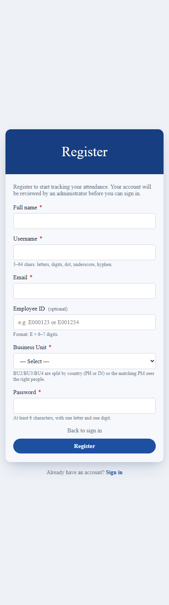

### Sign in

1. Open the app's URL.
2. Enter your **Username** and **Password**.
3. Click **Login**.

You'll land on the Dashboard.

### Forgot your password?

Password resets are handled by your administrator for security:

1. Message your administrator and ask for a reset.
2. They generate a **temporary password** for you.
3. Sign in with the temporary password — the app will **immediately prompt you to choose a new one**.

### Change your password

- Click your name (or **Change password**) in the bottom-left of the sidebar.
- Enter your current password and your new one twice (must be 6+ characters with one letter and one digit).
- Click **Update password**. You'll be signed in automatically with the new password.

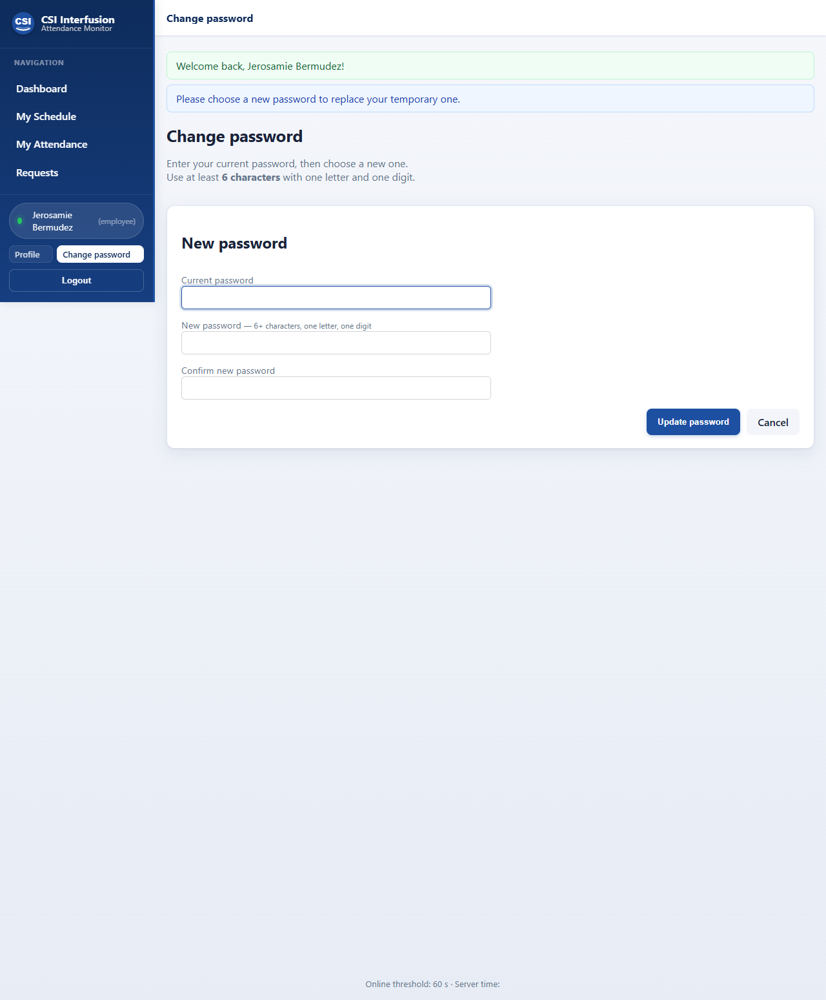

> If an admin reset your password, you'll be sent straight to this screen on your next sign-in — you can't access any other page until you pick a new password.

---

## The layout at a glance

Once signed in you'll see:

- **Left sidebar (navigation):**
  - **Dashboard** — your day at a glance.
  - **My Schedule / Schedule** — view or edit working days & times.
  - **My Attendance** — your history with date filters and CSV export.
  - **Requests** — file leave, shift changes, or add a missing time entry. (Admins see a unified review queue here.)
  - *(Admin/PM only)* **Reports**, **Users**, **Reminders**, **Configuration**, **Settings**.
- **Top bar:** page title and mobile menu toggle.
- **Bottom of sidebar:** your name with an online-status dot, **Profile**, **Change password**, and **Logout**.
- **Footer:** the server's current time and your computer's timezone label (e.g. `PHT`, `IST`).

The little **green dot** next to your name means you're considered "online" — the browser sends a heartbeat every 20 seconds. If your tab is hidden or closed for ~60 seconds, you'll show as offline.

---

## For employees

### Your dashboard

Your dashboard greets you with:

- A **Hi, *FirstName* 👋** banner and today's weekday.
- Your **scheduled shift** (or "no shift scheduled" if it's a day off).
- A **Check in** button (or **Check out** if you've already started).
- Badges showing **On time / Late** with how many minutes late you were.
- After check-out: a **Completed today** badge with total **hours rendered**.
- Quick stats and links to recent activity.

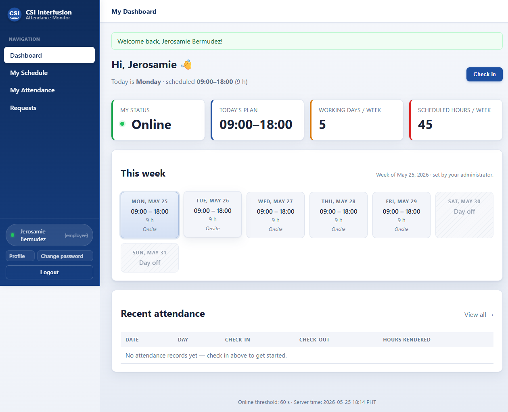

If your **next shift** begins within the grace window (e.g. crossing midnight), a separate **Check in for next shift** button appears alongside today's "Completed" badge.

### Checking in and out

**Check in:**

1. Click **Check in** on the dashboard.
2. The selfie modal opens — see [Selfie capture](#selfie-capture).
3. After capturing, the system verifies you're within your scheduled window:
   - Up to **15 minutes early** is allowed for regular shifts.
   - Support (24/7) users get a **60-minute** grace.
   - If you're earlier than that, a **"Clock in early anyway"** override may appear, and an admin will see the variance on the daily report.
4. Once accepted, your check-in time is recorded.

**Check out:**

1. Click **Check out** on the dashboard.
2. Take a check-out selfie.
3. Your record is closed and total **hours rendered** is calculated.

> **Heads-up:** the check-out button is blocked if you haven't met the required render hours (8h for Support, 9h for everyone else) — unless you have an approved **Early checkout** leave request for today.

### Taking a break or lunch

While you're checked in, two extra buttons appear:

- **☕ Break** — up to **2 short breaks per day** (about 15 minutes each). Pauses offline alerts so you don't get flagged when stepping away.
- **🍽 Start lunch** — **1 lunch per day**, pauses offline alerts for an hour.

Click again (**End break** / **End lunch**) when you're back. Run out for the day? File a **Break/lunch reset request** under **Requests** and your PM/admin can reset the counter.

### Selfie capture

When you check in or out, a modal asks for a quick selfie:

1. Allow camera access if prompted.
2. The app checks there's actually a face in the frame (no lens-cap, no all-black photo).
3. Click **Use this photo** to confirm, or **Retake** to try again.
4. The photo is attached to your attendance record (visible only to you and to admins/PMs in your Business Unit).

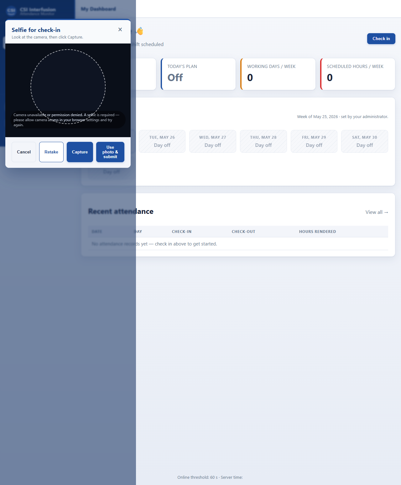

If your camera fails, the check itself is non-blocking — but you should still let your manager know.

### Viewing your attendance history

**My Attendance** shows your check-ins as a table:

| Column | What it shows |
|---|---|
| **Date** | The work date (handles cross-midnight shifts). |
| **Check-in / Check-out** | Local times. |
| **Hours Rendered** | Gross duration from in to out. |
| **OT / UT** | Overtime or undertime against scheduled hours. |
| **Status** | On time / Late / etc. |
| **Attendance Status** | Onsite / Offsite / Day-off (from your schedule). |
| **Remarks** | Notes added by you or an admin. |
| **Selfies** | Thumbnails of your in/out photos. |
| **Actions** | Request an edit if a time is wrong. |

You can:

- Filter by **From / To** dates (defaults to your most recent 200 entries).
- Click **Download CSV** to export the filtered view to a spreadsheet.
- Click **Request edit** on a row to ask an admin to fix a wrong time.

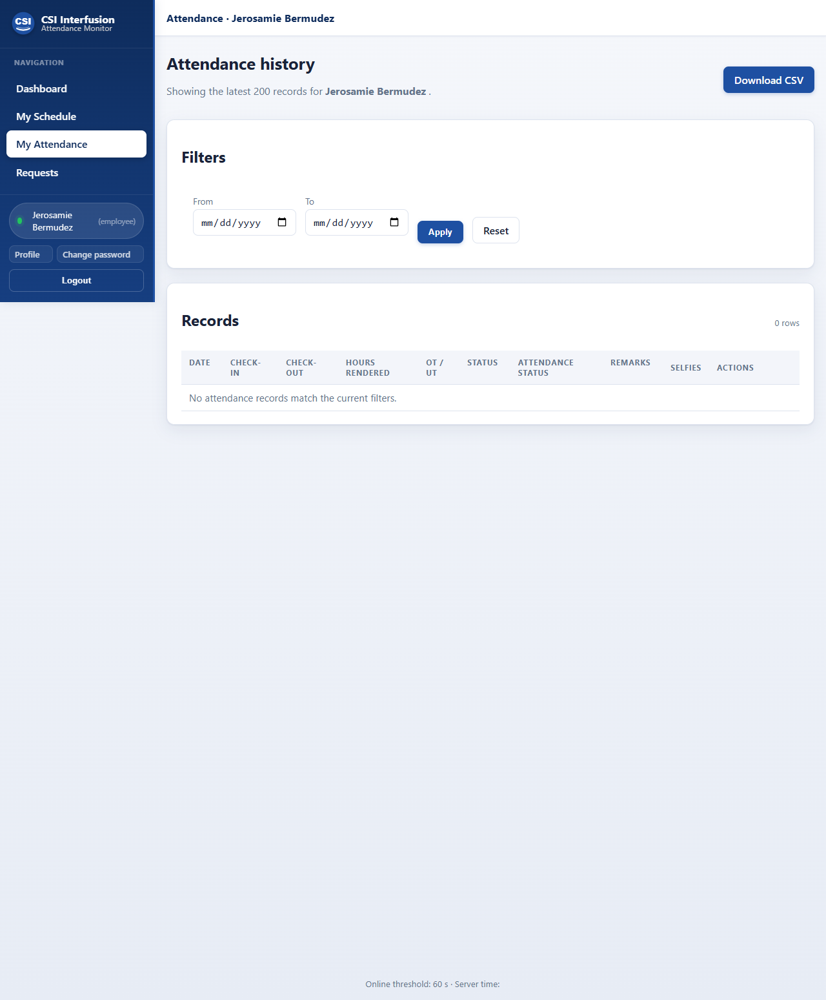

### Your schedule

**My Schedule** shows a monthly calendar of your shifts.

- Days marked as **Onsite**, **Offsite**, or **Day off**.
- Each working day shows start–end times and total hours.
- You can switch months via the **Month** picker and filter to a single week.
- If your schedule looks wrong, **file a Shift Change request** instead of editing directly — only admins/PMs can change schedules.

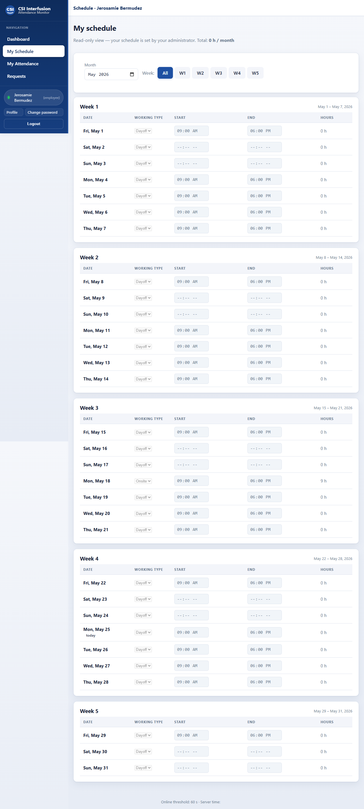

> Support (24/7) users can have overnight shifts (e.g. `22:00 → 06:00`).

### Filing a request

Click **Requests** in the sidebar. You'll see three sub-tabs:

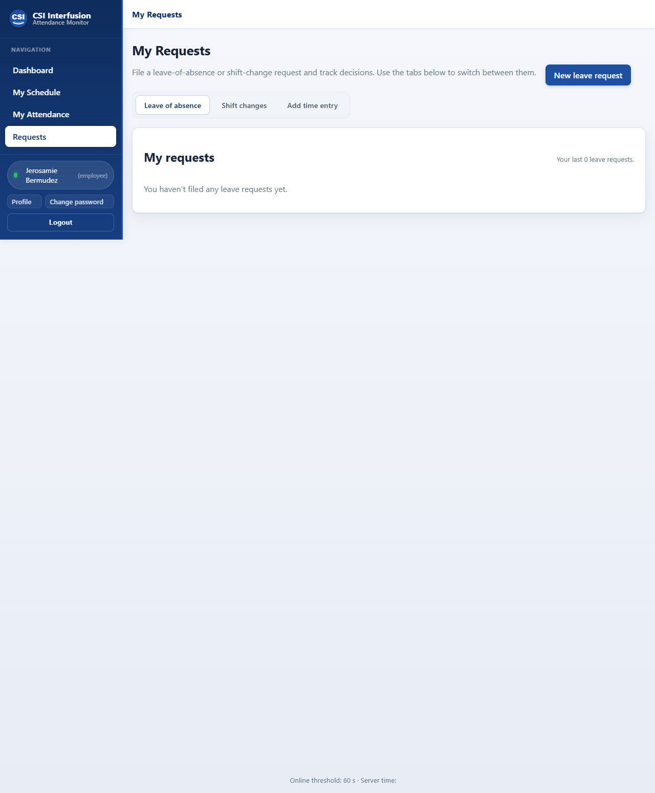

#### 1. Leave of absence

1. Click **+ New leave request** (or open the **Leave** tab).
2. Pick a **Leave type**:
   - **Full day** — 8 hours/day across a date range.
   - **Half day** — 4 hours for one day.
   - **Undertime** — a custom number of hours short for one day.
   - **Early checkout** — unlock today's check-out before the required render hours are met.
3. Set the **Start** and **End** date/time.
4. For Undertime / Early checkout, enter **Hours short**.
5. Add a **Reason** (5+ characters).
6. Attach a **proof image** (medical certificate, screenshot, etc.).
7. Click **Submit request**.

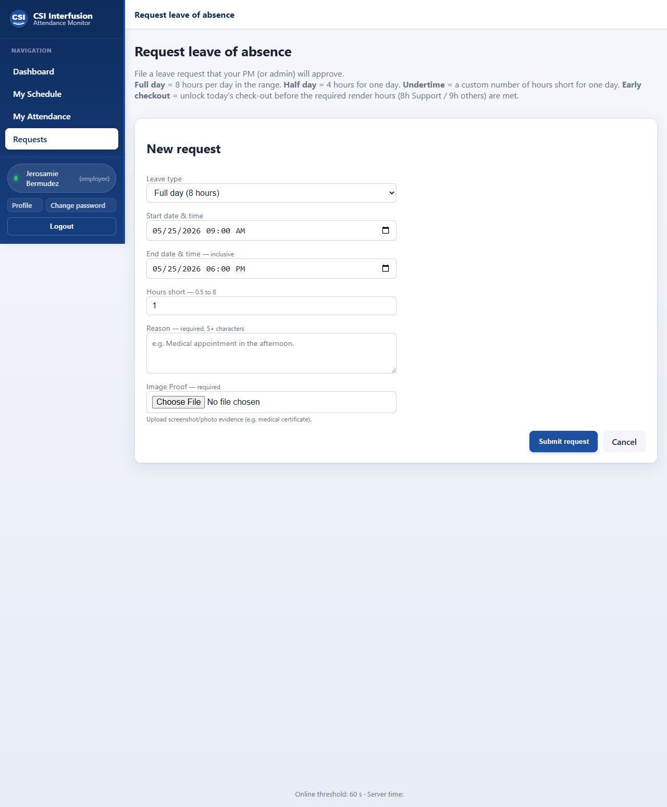

Your PM/admin gets an email and you'll see the decision back in this tab.

#### 2. Shift changes

If your schedule needs to change for one or more specific dates:

1. Pick the dates you want changed.
2. Propose the new shift times (or mark as Day off).
3. Add a brief reason.
4. Submit — your PM/admin will approve or reject.

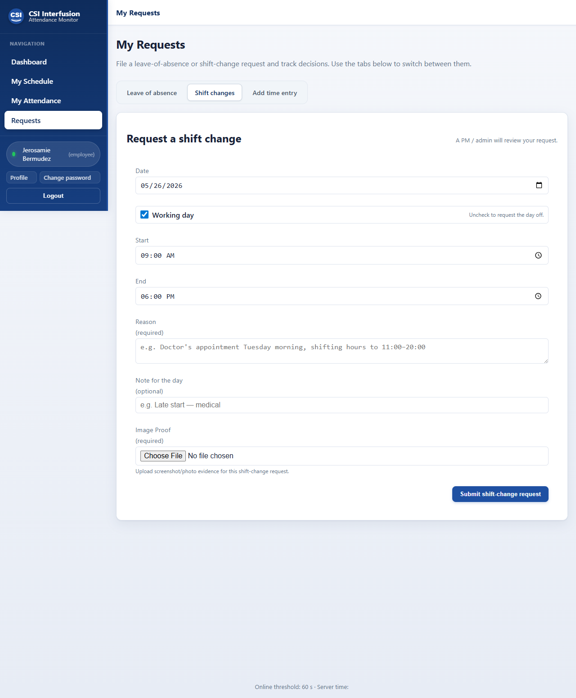

#### 3. Add time entry

For days you **forgot to clock in or out**:

1. Open **Requests → Add time entry**.
2. Pick a **Work date** from the dropdown — only **scheduled working days from the last 30 days with no attendance record yet** are listed.
3. Enter the **Check-in time** (the date is filled automatically).
4. Optionally fill the check-out time.
5. Submit. Your admin/PM will review the entry.

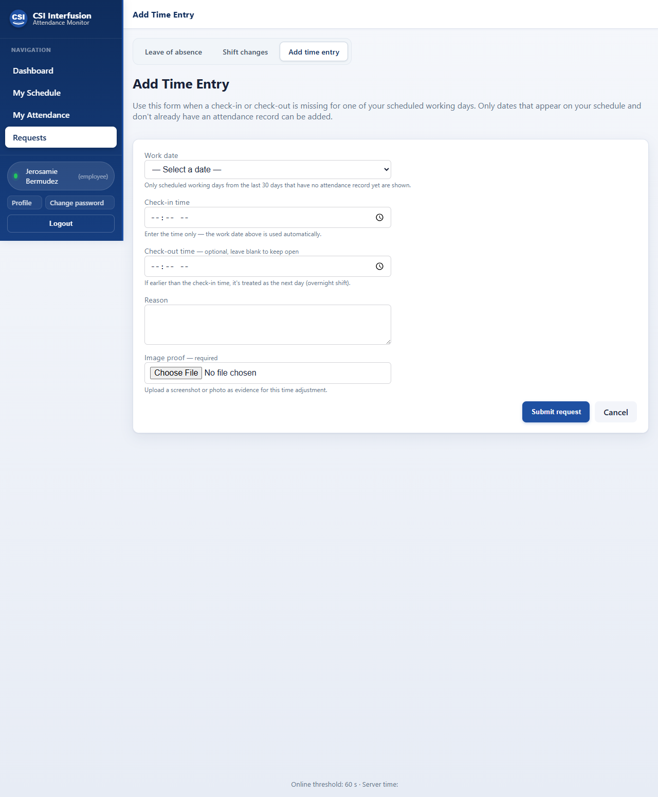

### Your profile

- Click **Profile** in the sidebar footer (or your name).
- Shows your account fields (name, username, email, Employee ID, Business Unit, role) and a weekly schedule + recent attendance summary.
- To change any account detail, ask your administrator.

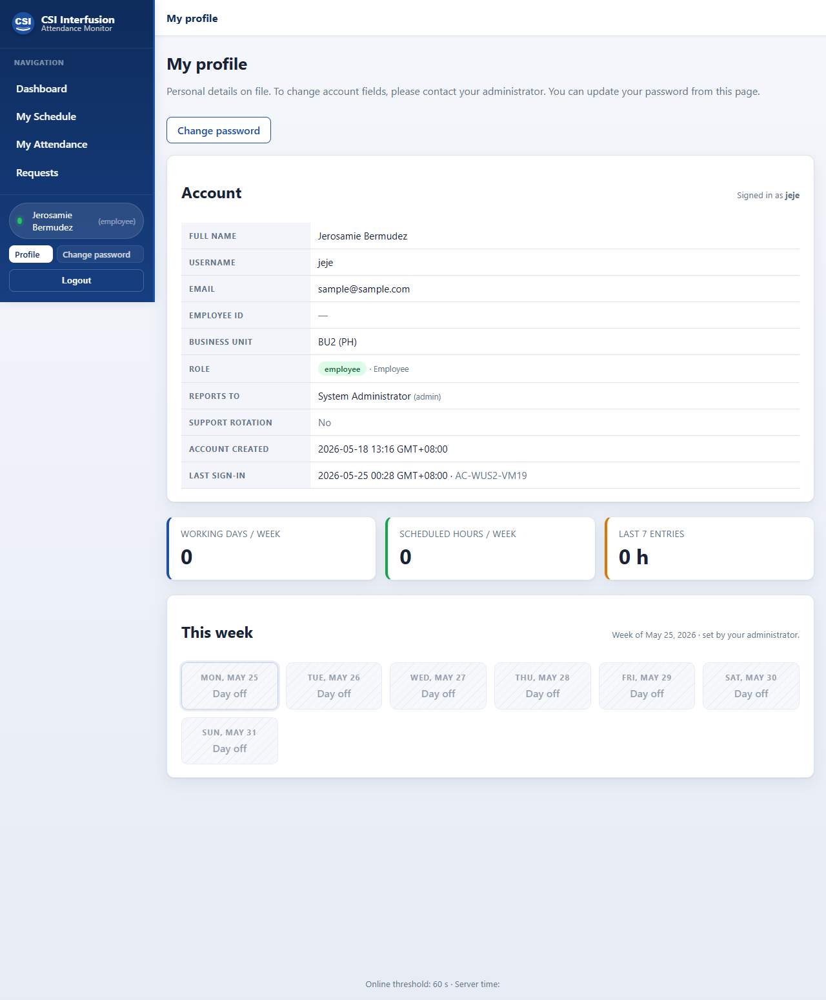

---

## For admins, PMs and Program Managers

> PMs and Project Managers see **only users in their Business Unit**. Program Managers can be assigned multiple BUs. Pure Admins see everyone.

### Team dashboard

The admin Dashboard shows:

- **KPIs at the top**: online, offline, present today, total users.
- A live **team status table** with:
  - Online/offline dot (auto-refreshes every 15 seconds).
  - Business Unit badge.
  - Today's check-in / check-out / hours rendered.
  - Late status badge.
- Sortable columns — click a header to sort.

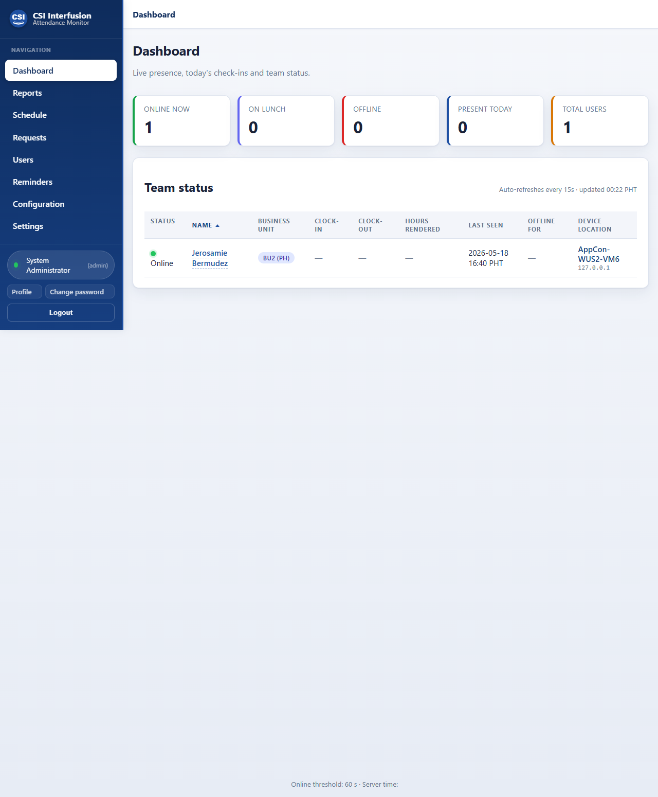

PMs and Program Managers also see their **own check-in/out** controls at the top, exactly like an employee.

### Approving new users

1. Open **Users** in the sidebar. If there are pending registrations, you'll see a **red badge** with the count and a **Pending approvals** card at the top.
2. For each row:
   - **Approve** to let them sign in.
   - **Reject** to delete the registration.
3. Approving requires a **Business Unit** to be filled in (except for Program Managers).

When you approve, the new user gets a "you're approved" email.

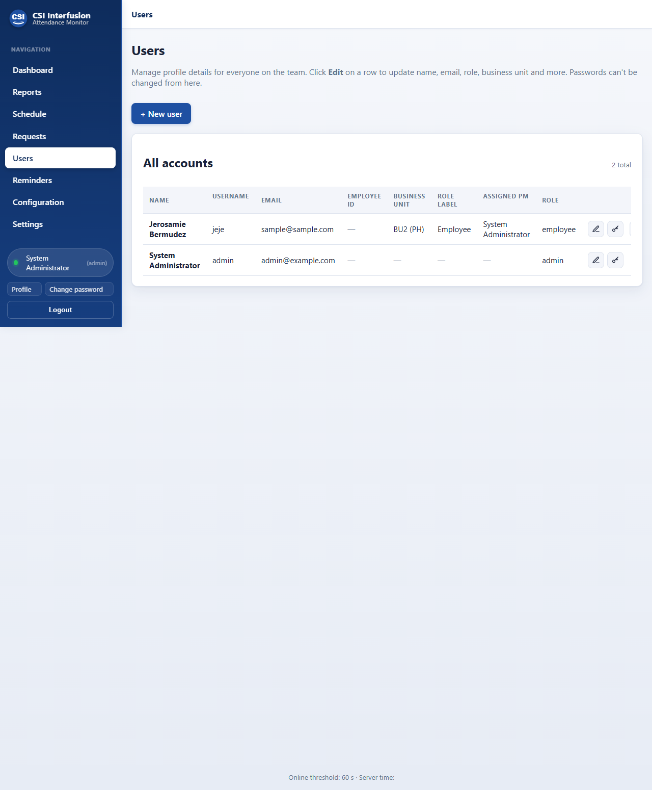

### Managing users

From the **Users** page you can:

- Click **+ New user** to create an account directly (skips approval — they can sign in straight away).
- Click **Edit** on any row to update name, username, email, Employee ID, **Business Unit**, and role.
- **Passwords can't be changed here.** Use the password-reset flow (a temporary password is set; the user changes it on first sign-in).
- Only pure Admins can grant the **Admin** role.
- You can't demote the last remaining admin — that's prevented automatically.

### Editing schedules

From **Schedule** (admins/PMs):

1. Pick a team member from the dropdown.
2. Pick a month (and optionally filter by week).
3. For each date, set:
   - **Working** (with start/end times) or **Day off**.
   - **Work type**: Onsite / Offsite.
4. Click **Save** at the bottom — total hours per week update live.

Notes:

- **Admin** accounts don't have a working schedule.
- **Support (24/7)** users can have overnight wrap-around shifts.
- Schedule changes employees request show under **Requests → Shift changes**.

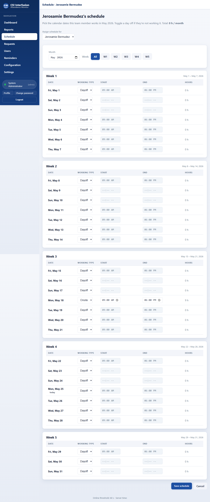

### Reviewing requests

The **Requests** tab is the unified hub. Sub-tabs let you switch between four queues:

1. **Attendance edits** — employees asking for a clock-in/out time correction.
2. **Leave** — leave-of-absence, half-day, undertime, early checkout.
3. **Shift changes** — proposed schedule changes for specific dates.
4. **Break / lunch resets** — employees who used up their daily quota and need another.

For each row you can:

- Click to expand and see the details + proof image (where applicable).
- **Approve** or **Reject** individually with an optional decision note.
- Use the **bulk toolbar** to select multiple rows and approve/reject them all at once with a shared note.

Decisions email the employee automatically. Approving an attendance-edit request writes the new times directly into the attendance record with an audit-log entry.

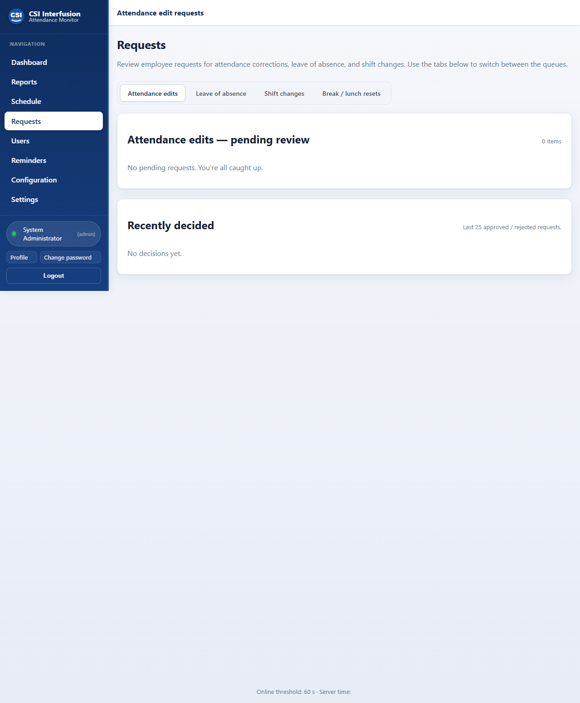

### Reports

**Reports** has two sub-tabs:

#### Daily report

- One row per team member per workday.
- Columns: hours rendered, attendance status, late status, schedule variance, violations.
- Filter by **date range**, **Business Unit**, and **Employee**.
- The **Include non-working days** checkbox shows day-off rows too.
- Click **Export to Excel** to download an `.xlsx` matching the current filters.

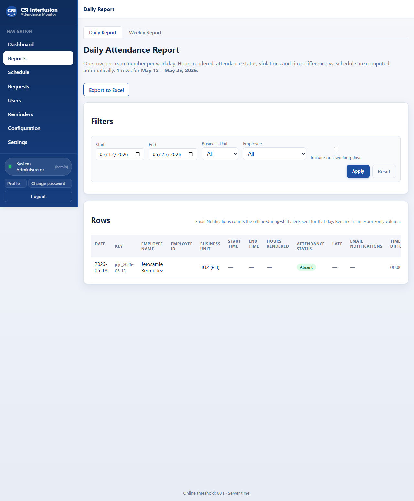

#### Weekly report

- Aggregated hours per user across a whole week.
- Same filters and export.

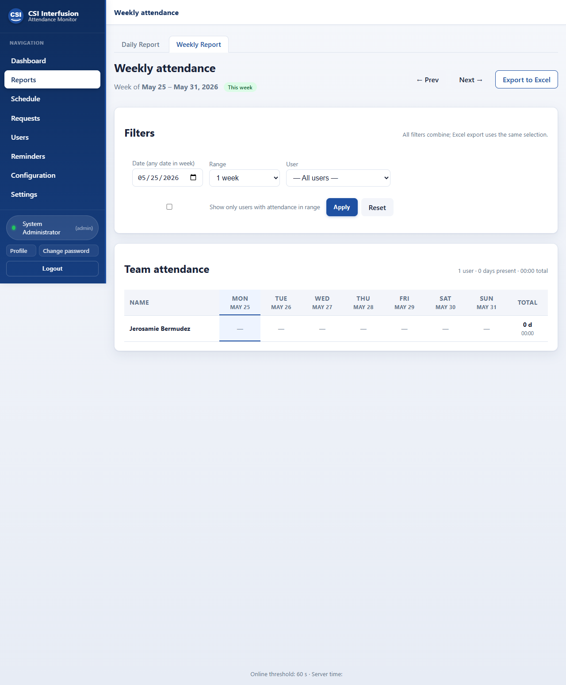

### Reminders (offline alerts)

The background monitor watches every check-in. If someone goes **offline during a shift** (no heartbeat for too long), a reminder is logged and emailed to:

- The employee.
- All admins/Program Managers.
- PMs in the same Business Unit.

On the **Reminders** page (admin/PM only) you can:

- Filter by **Pending / Actioned / All**.
- Issue a **formal warning**, or **override** the reminder.
- See exactly which shift triggered the alert with timestamps in your local timezone.

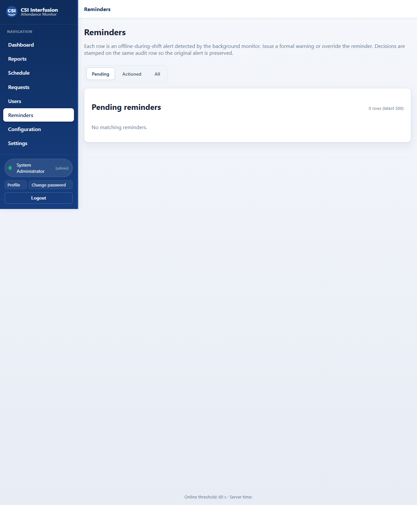

A similar system fires a "**forgot to check out**" reminder once an employee passes the required render hours with an open attendance record.

### Configuration (roles)

*(Pure Admins only.)* Under **Configuration** you can add custom role labels (e.g. "Senior Engineer", "QA Lead"). Each custom role maps to one of four built-in **permission tiers**:

- **Administrator**
- **Program Manager**
- **Project Manager (PM)**
- **Employee**

The four built-in rows can't be deleted — only your custom labels can.

### System settings

*(Pure Admins only.)* The **Settings** page is a **read-only** view of the runtime configuration sourced from `appsettings.json` and environment variables — connection strings, online threshold, session lifetime, email provider, deployment mode, etc.

To change a value you need to update the deployment config (Render dashboard or local file) and restart the app.

---

## Tips, gotchas & FAQ

**Why am I shown as offline even though I'm at my desk?**
The "online" indicator relies on your tab being open and visible. If you locked your workstation, switched to a hidden tab for over 60 seconds, or your network dropped, you'll show offline. The app will catch up on the next heartbeat (every 20 seconds).

**My check-in button says I'm not yet scheduled to clock in.**
You're more than 15 minutes (60 minutes for Support) before your shift. Either wait, or use the **Clock in early anyway** override when it appears — your admin will see the variance.

**The check-out button is greyed out / blocked.**
You haven't yet rendered the minimum hours (8h Support, 9h everyone else). File an **Early checkout** leave request under **Requests** and wait for approval, then try again.

**I clocked in but forgot to clock out yesterday.**
Open **Requests → Attendance edits → Request edit** on yesterday's row and propose the correct check-out time. An admin will approve or reject.

**My shift crosses midnight — does that work?**
Yes. If you start at 22:00 and end at 06:00, the system records the work date as the **start** date and handles the cross-midnight checkout automatically.

**Why can't I see other people in the Users list?**
You're likely a PM (Project Manager) — you only see users in your own Business Unit. Pure Admins and Program Managers see everyone in their assigned scope.

**What happens to my data when I close the tab?**
The browser fires an immediate "offline" signal so the dashboard updates within seconds. Your check-in record stays open — you still need to come back and click **Check out** to close it.

**Where do email notifications come from?**
Emails are sent through the configured SMTP provider (Brevo, SendGrid, etc.). If you're not receiving them, check your spam folder first, then ask your admin to verify the email provider configuration.

**Is there a way to bulk-approve requests?**
Yes — every Requests queue has a **bulk toolbar**. Tick the master checkbox, optionally add a shared note, and click **Approve selected** or **Reject selected**.

---

## Need more help?

- Talk to your **Program Manager** or **Project Manager** first — they usually handle approvals and schedule changes.
- For account problems (lost password, locked out, wrong Business Unit), contact your **Administrator**.
- For technical errors (page won't load, exports fail), include a screenshot and the time it happened — that helps your admin investigate quickly.

Happy tracking! 🕒
